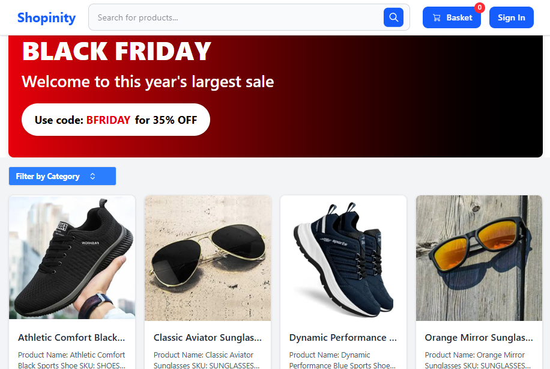

# 🛍️ Shopinity - Modern E-Commerce Platform

A full-featured, modern e-commerce platform built with Next.js 15, Sanity CMS, Stripe payments, and Clerk authentication. Shopinity provides a seamless shopping experience with real-time content management, secure payment processing, and responsive design.


---

## 🖼️ Preview

<p align="center">
  
</p>

---

## 🔗 Live Demo : [View Live Demo](https://shopinity-smr.vercel.app/)

---

## ✨ Features

### 🔐 Authentication & User Management
- **Clerk Authentication** - Secure user registration, login, and session management
- **User Profiles** - Personal account management and order history
- **Protected Routes** - Secure access to user-specific content

### 🛒 E-Commerce Functionality
- **Product Catalog** - Comprehensive product listings with categories
- **Advanced Search** - Smart product search with filtering capabilities
- **Shopping Cart** - Persistent cart with Zustand state management
- **Secure Checkout** - Complete Stripe integration for payments
- **Order Management** - Full order tracking and history

### 🎨 Modern UI/UX
- **Responsive Design** - Mobile-first approach with Tailwind CSS
- **Smooth Animations** - Framer Motion for enhanced interactions
- **Loading States** - Professional loading indicators and feedback
- **Modern Components** - Shadcn/ui component library integration

### 📱 Content Management
- **Sanity CMS** - Headless content management system
- **Real-time Updates** - Live content synchronization
- **Preview Mode** - Content preview and draft management
- **Rich Content** - PortableText for rich product descriptions

## 🚀 Tech Stack

- **Frontend:** Next.js 15 (App Router), TypeScript, Tailwind CSS
- **UI Components:** Shadcn/ui, Framer Motion
- **Authentication:** Clerk
- **CMS:** Sanity
- **Payments:** Stripe
- **State Management:** Zustand
- **Deployment:** Vercel

## 🛠️ Getting Started

### Prerequisites
- Node.js 18+ and npm
- Stripe account for payments
- Sanity account for CMS
- Clerk account for authentication

### Installation

1. **Clone the repository**
   ```bash
   git clone https://github.com/smRid/ecom-next-sanity.git
   cd ecom-next-sanity
   ```

2. **Install dependencies**
   ```bash
   npm install
   ```

3. **Environment Setup**
   Create a `.env.local` file in the root directory and add:
   ```bash
   # Sanity Configuration
   NEXT_PUBLIC_SANITY_PROJECT_ID="your_project_id"
   NEXT_PUBLIC_SANITY_DATASET="production"
   SANITY_API_TOKEN="your_api_token"
   SANITY_API_READ_TOKEN="your_read_token"

   # Clerk Authentication
   NEXT_PUBLIC_CLERK_PUBLISHABLE_KEY="your_clerk_publishable_key"
   CLERK_SECRET_KEY="your_clerk_secret_key"

   # Stripe Payment
   STRIPE_SECRET_KEY="your_stripe_secret_key"
   NEXT_PUBLIC_STRIPE_PUBLISHABLE_KEY="your_stripe_publishable_key"
   STRIPE_WEBHOOK_SECRET="your_webhook_secret"

   # Application URLs
   NEXT_PUBLIC_BASE_URL="http://localhost:3000"
   ```

4. **Run the development server**
   ```bash
   npm run dev
   ```

5. **Open your browser**
   Navigate to [http://localhost:3000](http://localhost:3000) to see the application.

### 🎛️ Sanity Studio Setup

1. **Access Sanity Studio**
   Navigate to [http://localhost:3000/studio](http://localhost:3000/studio)

2. **Create Content**
   - Add product categories
   - Create products with images and descriptions
   - Set up promotional sales and discounts

### 💳 Stripe Webhook Setup (Development)

For local development, use Stripe CLI to forward webhooks:

```bash
# Install Stripe CLI
# Login to your Stripe account
stripe login

# Forward webhooks to your local server
stripe listen --forward-to localhost:3000/api/webhooks
```

## 📁 Project Structure

```
src/
├── app/                    # Next.js app directory
│   ├── (store)/           # Store pages and layout
│   ├── api/               # API routes (webhooks)
│   └── studio/            # Sanity Studio
├── components/            # Reusable UI components
├── lib/                   # Utility functions and configurations
├── sanity/               # Sanity CMS configuration
│   ├── lib/              # Sanity client and utilities
│   └── schemaTypes/      # Content schemas
└── actions/              # Server actions
```

## 🔄 Available Scripts

```bash
# Development
npm run dev          # Start development server
npm run build        # Build for production
npm run start        # Start production server

# Code Quality
npm run lint         # Run ESLint
npm run type-check   # Run TypeScript checks

# Sanity
npm run sanity       # Start Sanity Studio standalone
```


## 🌟 Key Features Showcase

### Product Management
- Dynamic product catalog with categories
- Rich product descriptions with images
- Inventory tracking and management
- Search and filtering capabilities

### Shopping Experience
- Intuitive shopping cart interface
- Secure checkout process
- Order confirmation and tracking
- User account and order history

### Admin Features
- Real-time content management with Sanity
- Sales and promotion management
- Order processing and tracking

## 🤝 Contributing

1. Fork the repository
2. Create your feature branch (`git checkout -b feature/amazing-feature`)
3. Commit your changes (`git commit -m 'Add some amazing feature'`)
4. Push to the branch (`git push origin feature/amazing-feature`)
5. Open a Pull Request

## 📝 License

This project is licensed under the MIT License - see the [LICENSE](LICENSE) file for details.

## 🙏 Acknowledgments

- [Next.js](https://nextjs.org/) for the amazing React framework
- [Sanity](https://www.sanity.io/) for the flexible CMS
- [Stripe](https://stripe.com/) for secure payment processing
- [Clerk](https://clerk.dev/) for authentication services
- [Tailwind CSS](https://tailwindcss.com/) for utility-first styling
- [Shadcn/ui](https://ui.shadcn.com/) for beautiful components

---

**Built with ❤️ by [smRid](https://github.com/smRid)**

For questions or support, please open an issue or contact the maintainer.
